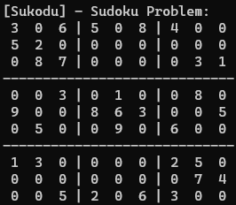
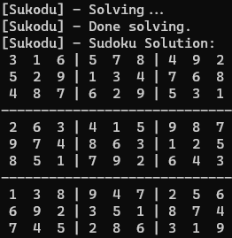

# sudoku

Solve sudoku puzzles w/ C++ !

| Input | Output |
| :-: | :-: |
|  |  |

## Install

- **Download** the repo or the `.zip` directory from the [github repo](https://github.com/XDwightsBeetsX/sudoku)

    ```shell
    > git clone https://github.com/XDwightsBeetsX/sudoku
    ```

## Usage

1. **Edit/Create the `input/input.csv` file** with the `.csv`-formatted 9x9 sudoku puzzle.
   
   Make sure you **update the `main.cpp`** if necessary.

    ```c++
    #include "src/SudokuSolver.h"
    #include "src/SudokuGenerator.h"

    using namespace std;

    int main() {
        // generate puzzles
        SudokuGenerator SG = SudokuGenerator();
        SG.generatePuzzles(10);

        // solve a puzzle
        std::string inputFilename = "input/sample.csv";

        SudokuSolver SS = SudokuSolver(inputFilename);
        SS.showProblem();
        if (SS.solve()) {
            SS.showSolution();
            SS.writeSolutionToFile();
        }
        return 0;
    }
    ```

2. **Compile** the executable with *Make*, `g++`, or similar. I like using [*MinGW's compilers*](https://www.mingw-w64.org/downloads/)...

    ```shell
    > make all
    ```

3. **Run** the solver

    ```shell
    > make run
    ```

---

> *see samples in the [input folder](./input/)*
> 
> *[view the code structure](./docs/structure.md)*
>
> *with help from [this](https://www.tutorialspoint.com/sudoku-solver-in-cplusplus) tutorialspoint tutorial*

---
