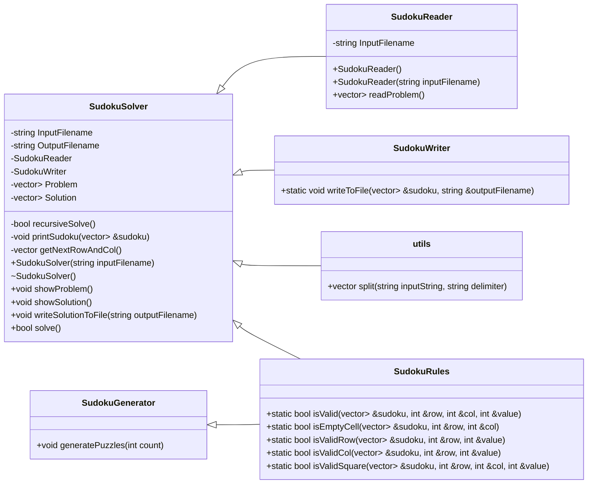

# Project Structure

## Folder Structure

```shell
sudoku
│   .gitignore
│   LICENSE
│   main.cpp
│   makefile
│   README.md
│
├───bin
│       sudoku.exe
│       *.o
│
├───docs
│       sample_format.md
│       structure.md
│
├───imgs
│       class_diagram.png
│
├───input
│   │   sample.csv
│   │
│   └───generated
│           gen_puzzle_1.csv
│           gen_puzzle_10.csv
│           gen_puzzle_2.csv
│           gen_puzzle_3.csv
│           gen_puzzle_4.csv
│           gen_puzzle_5.csv
│           gen_puzzle_6.csv
│           gen_puzzle_7.csv
│           gen_puzzle_8.csv
│           gen_puzzle_9.csv
│
├───output
│       sample-out.csv
│
└───src
        SudokuGenerator.cpp
        SudokuGenerator.h
        SudokuReader.cpp
        SudokuReader.h
        SudokuRules.cpp
        SudokuRules.h
        SudokuSolver.cpp
        SudokuSolver.h
        SudokuWriter.cpp
        SudokuWriter.h
        utils.cpp
        utils.h
```

## Class Diagram

### Image for Compatibility


### Mermaid Markdown



> *Arrows point towards the highest level class*
>
> *[Documentation](../docs/) is subject to change and may nto be up-to-date*
>
> *Last updated 2/20/2022*
