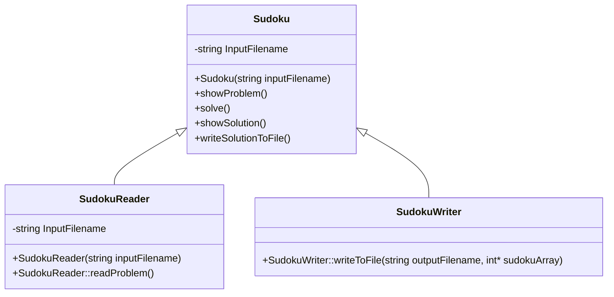

# Project Structure

## Folder Structure

```shell
main.cpp
src/
| Sudoku.h
| Sudoku.cpp
| SudokuReader.h
| SudokuReader.cpp
| SudokuWriter.h
| SudokuWriter.cpp
bin/
| sudoku_solver.exe
| main.o
| Sudoku.o
| SudokuReader.o
| SudokuWriter.o
input/
| input.csv
output/
| output.csv
docs/
| #docs...
```

## Class Diagram



> *Arrows point towards the highest level class*
