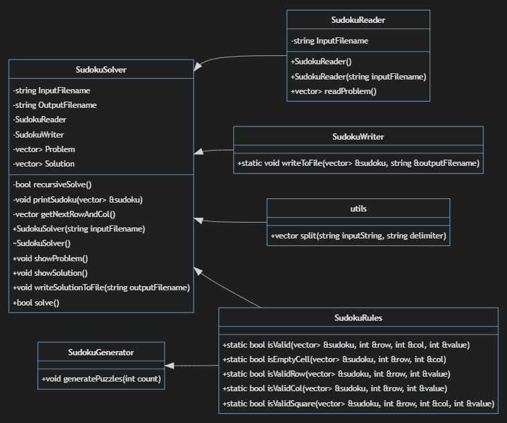
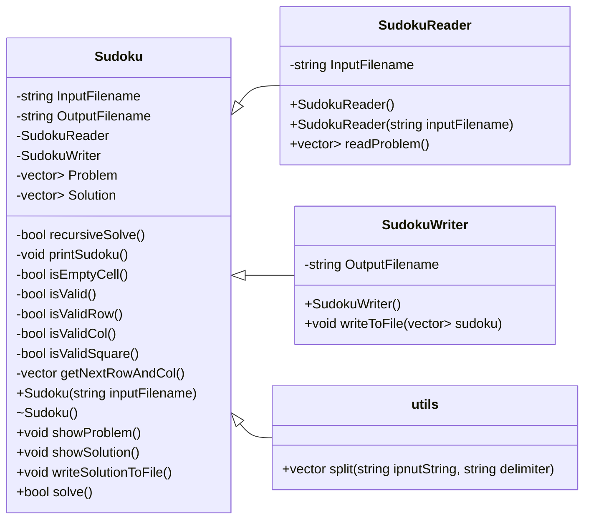

# Project Structure

## Folder Structure

```shell
sudoku
│
│   .gitignore
│   LICENSE
│   main.cpp
│   makefile
│   README.md
│
├───bin
│       sudoku_solver.exe
│       *.o
│
├───input
│       sample.csv
│
├───output
│       sample-out.csv
│
└───src
        Sudoku.cpp
        Sudoku.h
        SudokuReader.cpp
        SudokuReader.h
        SudokuWriter.cpp
        SudokuWriter.h
        utils.cpp
        utils.h
```

## Class Diagram

### Image for Compatibility



### Mermaid Markdown



> *Arrows point towards the highest level class*
>
> *[Documentation](../docs/) is subject to change and may nto be up-to-date*
